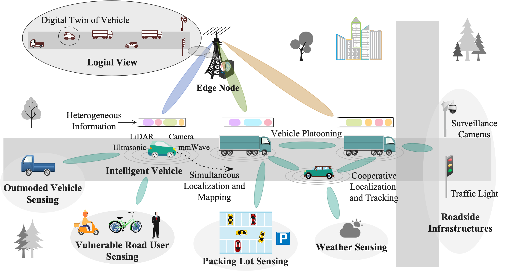
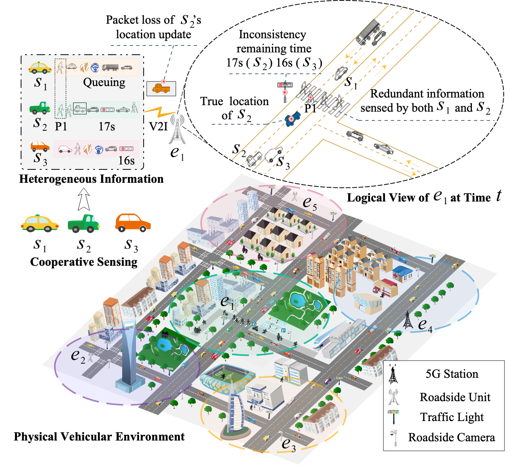
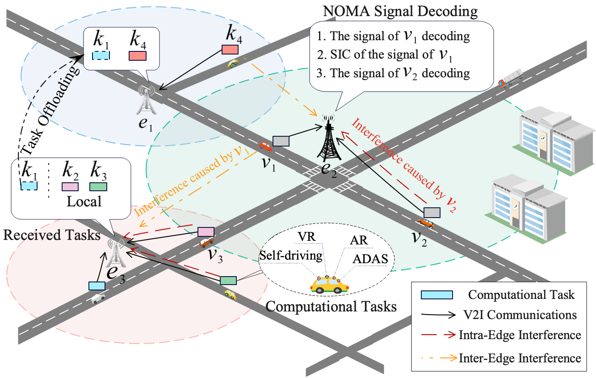

# Hi! U are the [](https://count.getloli.com/)-*th* visitor

I am currently a Postdoctoral Research Fellow in cooperation with [Prof. Shaohua Wan](https://scholar.google.com/citations?user=IhjhNEEAAAAJ&hl=en) at the Shenzhen Institute for Advanced Study, University of Electronic Science and Technology of China ([UESTC](https://www.uestc.edu.cn)), Shenzhen, China. I received the Ph.D. degree in Computer Science from the College of Computer Science at the Chongqing University ([CQU](https://www.cqu.edu.cn)), Chongqing, China, in 2023 and the B.S. degree in Network Engineering from the School of Computer and Control Engineering at the North University of China ([NUC](https://www.nuc.edu.cn)), Taiyuan, China, in 2017. I have authored and co-authored more than 10 papers with total google scholar <a href='https://scholar.google.com/citations?user=DK5avZUAAAAJ'></a>.     

My research interests include: 
- Vehicular Networks
- Vehicular Cyber-Physical Systems
- Edge Computing
- Deep Reinforcement Learning
- Game Theory

<!-- [CV](https://github.com/neardws/neardws/blob/master/docs/CV_XincaoXu.pdf) [简历](https://github.com/neardws/neardws/blob/master/docs/CV_XincaoXu_ZH.pdf)
 -->
## 🔥 News

- *2023.04*: My GitHub stars have reached 100!
- *2022.10*: 🎉🎉 One paper is accepted by JSA!
- *2022.10*: 🎉🎉 My google scholar citations have reached 100!
- *2022.09*: One invention patent is granted!
- *2022.06*: One paper is accepted by IEEE ITSC 2022!

## 🕒 Recent Research 


<div></div>

[Enabling Digital Twin in Vehicular Edge Computing: A Multi-Agent Multi-Objective Deep Reinforcement Learning Solution]()       
**Xincao Xu**, Kai Liu, Penglin Dai, and Biwen Chen

- We present a DT-VEC architecture, where the heterogeneous information can be sensed by vehicles and uploaded to the edge node via V2I communications. The DT-VEC are modeled at the edge node, forming a logical view to reflect the physical vehicular environment. 
- We model the DT-VEC by deriving an ISAC-assisted sensing model and a reliability-guaranteed uploading model. 
- We formulate the bi-objective problem to maximize the system quality and minimize the system cost, simultaneously. In particular, we define the quality of DT-VEC by considering the timeliness and consistency, and define the cost of DT-VEC by considering the redundancy, sensing cost, and transmission cost. 
- We propose a multi-agent multi-objective (MAMO) deep reinforcement learning solution implemented distributedly in the vehicles and the edge nodes. Specifically, a dueling critic network is proposed to evaluate the advantage of action over the average of random actions. 
- Submitted to **IEEE Transactions on Consumer Electronics** (under review)


<div></div>

[Cooperative Sensing and Heterogeneous Information Fusion in VCPS: A Multi-agent Deep Reinforcement Learning Approach](https://arxiv.org/abs/2209.12265)  
**Xincao Xu**, Kai Liu, Penglin Dai, Ruitao Xie, and Jiangtao Luo

- We present a VEC architecture, in which heterogeneous information can be cooperatively sensed and uploaded via V2I communications. Logical views can be constructed by fusing the heterogeneous information at edge nodes. 
- We derive a cooperative sensing model based on the multi-class M/G/1 priority queue. On this basis, we define a noval metric AoV by modeling the timeliness, completeness, and consistency of the logical views.
- We formulate the problem, which aims at maximizing the quality of VCPS. 
- We propose a multiagent DRL solution, where a difference-reward-based credit assignment is designed to divide the system reward into the difference reward for vehicles, reflecting their individual contributions.
- Submitted to **IEEE Transactions on Intelligent Transportation Systems** (under review)

<div></div>

[Joint Task Offloading and Resource Optimization in NOMA-based Vehicular Edge Computing: A Game-Theoretic DRL Approach](https://www.sciencedirect.com/science/article/pii/S138376212200265X)  
**Xincao Xu**, Kai Liu, Penglin Dai, Feiyu Jin, Hualing Ren, Choujun Zhan, and Songtao Guo

- We present a NOMA-based VEC architecture, where heterogeneous resources of edge nodes are cooperated for real-time task processing.
- We derive a V2I transmission model by considering both intra-edge and inter-edge interference and formulate a cooperative resource optimization (CRO) problem by jointly optimizing real-time task offloading and heterogeneous resource allocation, aiming at maximizing the service ratio.
- We decompose the CRO into two subproblems, namely, task offloading and resource alloction. The first subproblem is modeled as an EPG with Nash equilibrium (NE) existence and converagence, and a multi-agent D4PG algorithm is proposed to achieve the NE by adopting the potential function as reward function. The second subproblem is divided into two independent convex optimization problems, and an optimal solution is proposed based on a gradient-based iterative method and KKT condition.
- Accepted by **Journal of Systems Architecture** (JCR Q1)

## 📖 Publications

**JCR**: [Journal Citation Reports by Clarivate Com.](https://jcr.clarivate.com/jcr/home)    
**SCI**: [Journal Partition List by National Science Library, Chinese Academy of Sciences](https://www.fenqubiao.com)    
**CCF**: [Recommended Publications by China Computer Federation](https://www.ccf.org.cn/Academic_Evaluation/By_category/)    
**\***: Corresponding Author

#### Journal

- **Xincao Xu**, Kai Liu<sup>**\***</sup>, Penglin Dai, Feiyu Jin, Hualing Ren, Choujun Zhan, and Songtao Guo, [Joint Task Offloading and Resource Optimization in NOMA-Based Vehicular Edge Computing: A Game-Theoretic DRL Approach](https://www.sciencedirect.com/science/article/pii/S138376212200265X), *Journal of Systems Architecture*, volume 134, pp. 102780, January 2023. IF: 5.836 (2021), 4.497 (5-year) [JCR Q1\|SCI Q2\|CCF B] [](https://scholar.google.com/citations?view_op=view_citation&hl=en&user=DK5avZUAAAAJ&citation_for_view=DK5avZUAAAAJ:Y5dfb0dijaUC) [](https://github.com/neardws/Game-Theoretic-Deep-Reinforcement-Learning)
- Chunhui Liu, Kai Liu<sup>**\***</sup>, Hualing Ren, **Xincao Xu**, Ruitao Xie and Jingjing Cao, [RtDS: Real-time Distributed Strategy for Multi-period Task Offloading in Vehicular Edge Computing Environment](https://link.springer.com/article/10.1007/s00521-021-05766-5), *Neural Computing and Applications*, to appear. IF: 5.606 (2020), 5.573 (5-year) [JCR Q1\|SCI Q2] [](https://scholar.google.com/citations?view_op=view_citation&hl=en&user=DK5avZUAAAAJ&citation_for_view=DK5avZUAAAAJ:4fKUyHm3Qg0C)
- Ke Xiao, Kai Liu<sup>**\***</sup>, **Xincao Xu**, Liang Feng, Zhou Wu and Qiangwei Zhao, [Cooperative Coding and Caching Scheduling via Binary Particle Swarm Optimization in Software Defined Vehicular Networks](https://link.springer.com/article/10.1007/s00521-020-04978-5), *Neural Computing and Applications*, volume 33, issue 5, pp. 1467-1478, May 2021. IF: 5.606 (2020), 5.573 (5-year) [JCR Q1\|SCI Q2] [](https://scholar.google.com/citations?view_op=view_citation&hl=en&user=DK5avZUAAAAJ&citation_for_view=DK5avZUAAAAJ:l7t_Zn2s7bgC)
- Ke Xiao, Kai Liu<sup>**\***</sup>, **Xincao Xu**, Yi Zhou and Liang Feng, [Efficient Fog-assisted Heterogeneous Data Services in Software Defined VANETs](https://link.springer.com/article/10.1007/s12652-019-01507-8), *Journal of Ambient Intelligence and Humanized Computing*, volume 12, issue 1, pp.261-273, January 2021. IF: 7.104 (2020), 6.163 (5-year) [JCR Q2\|SCI Q3] [](https://scholar.google.com/citations?view_op=view_citation&hl=en&user=DK5avZUAAAAJ&citation_for_view=DK5avZUAAAAJ:CHSYGLWDkRkC)
- **Xincao Xu**, Kai Liu<sup>**\***</sup>, Ke Xiao, Liang Feng, Zhou Wu and Songtao Guo, [Vehicular Fog Computing Enabled Real-time Collision Warning via Trajectory Calibration](https://link.springer.com/article/10.1007/s11036-020-01591-7), *Mobile Networks and Applications*, volume 25, issue 6, pp. 2482-2494, December 2020. IF: 2.602 (2019), 2.76 (5-year) [JCR Q2\|CCF C] [](https://scholar.google.com/citations?view_op=view_citation&hl=en&user=DK5avZUAAAAJ&citation_for_view=DK5avZUAAAAJ:tOudhMTPpwUC) [](https://github.com/neardws/fog-computing-based-collision-warning-system)
- Kai Liu<sup>**\***</sup>, **Xincao Xu**, Mengliang Chen, Bingyi Liu<sup>**\***</sup>, Libing Wu and Victor Lee, [A Hierarchical Architecture for the Future Internet of Vehicles](https://ieeexplore.ieee.org/document/8767077), *IEEE Communications Magazine*, volume 57, issue 7, pp. 41-47, July 2019. IF: 10.356  (2018), 12.091 (5-year) [JCR Q1\|SCI Q1] [](https://scholar.google.com/citations?view_op=view_citation&hl=en&user=DK5avZUAAAAJ&citation_for_view=DK5avZUAAAAJ:1sJd4Hv_s6UC)

#### Conference

- **Xincao Xu**, Kai Liu, Qisen Zhang, Hao Jiang, Ke Xiao and Jiangtao Luo, [Age of View: A New Metric for Evaluating Heterogeneous Information Fusion in Vehicular Cyber-Physical Systems](https://ieeexplore.ieee.org/abstract/document/9921762), IEEE 25th International Conference on Intelligent Transportation Systems (*IEEE ITSC’22*), Macau, China, October 8-12, 2022. [](https://scholar.google.com/citations?view_op=view_citation&hl=en&user=DK5avZUAAAAJ&citation_for_view=DK5avZUAAAAJ:_B80troHkn4C) [](https://github.com/neardws/Age-of-View) [](https://neardws-1257861591.cos.ap-shanghai.myqcloud.com/2022/09/20220915013208ITSC2022_Sildes591.pdf) [](https://youtu.be/iayUfkFCMcs)
- Chunhui Liu, Kai Liu, **Xincao Xu**, Hualing Ren, Feiyu Jin and Songtao Guo, [Real-time Task Offloading for Data and Computation Intensive Services in Vehicular Fog Computing Environments](https://ieeexplore.ieee.org/abstract/document/9394299), IEEE International Conference on Mobility, Sensing and Networking (*IEEE MSN’20*), Tokyo, Japan, December 17-19, 2020. [](https://scholar.google.com/citations?view_op=view_citation&hl=en&user=DK5avZUAAAAJ&citation_for_view=DK5avZUAAAAJ:sSrBHYA8nusC)
- Yi Zhou, Kai Liu, **Xincao Xu**, Chunhui Liu, Liang Feng and Chao Chen, [Multi-period Distributed Delay-sensitive Tasks Offloading in a Two-layer Vehicular Fog Computing Architecture](https://link.springer.com/chapter/10.1007/978-981-15-7670-6_38), International Conference on Neural Computing and Applications (*NCAA’20*), Shenzhen, China, July 3-6, 2020. [](https://scholar.google.com/citations?view_op=view_citation&hl=en&user=DK5avZUAAAAJ&citation_for_view=DK5avZUAAAAJ:vRqMK49ujn8C)
- Yi Zhou, Kai Liu, **Xincao Xu**, Songtao Guo, Zhou Wu, Victor Lee and Sang Son, [Distributed Scheduling for Time-Critical Tasks in a Two-layer Vehicular Fog Computing Architecture](https://ieeexplore.ieee.org/document/9045579), IEEE Consumer Communications and Networking Conference (*IEEE CCNC’20*), Las Vegas, USA, January 11-14, 2020. [](https://scholar.google.com/citations?view_op=view_citation&hl=en&user=DK5avZUAAAAJ&citation_for_view=DK5avZUAAAAJ:K3LRdlH-MEoC)
- **Xincao Xu**, Kai Liu, Ke Xiao, Hualing Ren, Liang Feng and Chao Chen, [Design and Implementation of a Fog Computing Based Collision Warning System in VANETs](https://ieeexplore.ieee.org/document/8805783), IEEE International Symposium on Product Compliance Engineering-Asia (*IEEE ISPCE-CN’18*), Hong Kong/Shengzhen, December 5-7, 2018. (Best Paper Award) [](https://scholar.google.com/citations?view_op=view_citation&hl=en&user=DK5avZUAAAAJ&citation_for_view=DK5avZUAAAAJ:xtRiw3GOFMkC) [](https://github.com/cqu-bdsc/Collision-Warning-System)

#### Chinese Papers

- **Xincao Xu**, Kai Liu<sup>**\***</sup>, Chunhui Liu, Hao Jiang, Songtao Guo and Weiwei Wu, [Potential Game Based Channel Allocation for Vehicular Edge Computing](https://www.ejournal.org.cn/CN/10.12263/DZXB.20200994), *Tien Tzu Hsueh Pao/Acta Electronica Sinica*, volume 49, issue 5, pp.851-860, July 2021. [CCF T1] [](https://scholar.google.com/citations?view_op=view_citation&hl=en&user=DK5avZUAAAAJ&citation_for_view=DK5avZUAAAAJ:fQNAKQ3IYiAC) [](https://github.com/neardws/Incentive-based-Probability-Update-and-Strategy-Selection)
- **Xincao Xu**, Yi Zhou, Kai Liu, Chaocen Xiang, Yantao Li and Songtao Guo, Potenial Game based Distributed Channel Allocation in Vehicular Fog Computing Environments, 14th China Conference on Internet of Things (*CWSN’20*), Dunhuang, China, September 18-21, 2020. (Best Paper Candidate)

## 💻 Coding

[](https://github.com/neardws/github-readme-stats)
<!-- waka-box start -->
📊 Weekly development breakdown
```text
Python     🕓 4h52m ███████████████████████▍░░░░ 83.5%
sh         🕓 30m   ██▍░░░░░░░░░░░░░░░░░░░░░░░░░  8.8%
Text       🕓 26m   ██▏░░░░░░░░░░░░░░░░░░░░░░░░░  7.7%
Git Config 🕓 0s    ░░░░░░░░░░░░░░░░░░░░░░░░░░░░  0.0%
```
<!-- Powered by https://github.com/journey-ad/waka-box-go . -->
<!-- waka-box end -->
